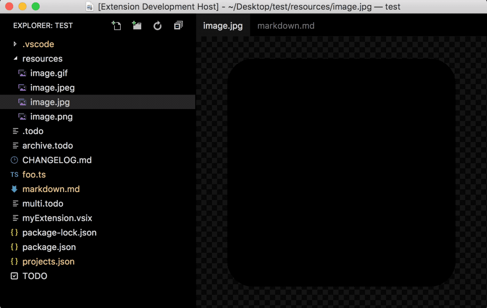

# Open in Application

<p align="center">
	
</p>

Open an arbitrary file in its default app, or the app you want.

This is customizable: you can provide a custom app for each extension, or even multiple apps for an extension and then manually pick the one to use.

## Install

Follow the instructions in the [Marketplace](https://marketplace.visualstudio.com/items?itemName=fabiospampinato.vscode-open-in-application), or run the following in the command palette:

```shell
ext install fabiospampinato.vscode-open-in-application
```

## Usage

It adds 1 command to the command palette:

```js
'Open in Application' // Open the current file in its default app, or the app you want
```

You can also reach this command with a right click in the explorer.

## Settings

```js
{
  "openInApplication.applications": {} // Map between extensions and applications
}
```

The actual application's name to use is OS-dependant, for instance if you want to open Firefox under Ubuntu you have to use "firefox" (lowercase) in your settings. We use the [open](https://www.npmjs.com/package/open) utility under the hood, everything that works with it will work here.

Example settings for custom application:

```js
{
  "openInApplication.applications": {
    "html": "Firefox" // Always use Firefox for opening html files
  }
}
```

Example settings for custom applications:

```js
{
  "openInApplication.applications": {
    "html": ["Google Chrome", "Firefox"] // Ask which application to use when opening html files
  }
}
```

## Demo



## Contributing

If you found a problem, or have a feature request, please open an [issue](https://github.com/fabiospampinato/vscode-open-in-application/issues) about it.

If you want to make a pull request you can debug the extension using [Debug Launcher](https://marketplace.visualstudio.com/items?itemName=fabiospampinato.vscode-debug-launcher).

## License

MIT © Fabio Spampinato
